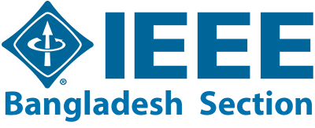
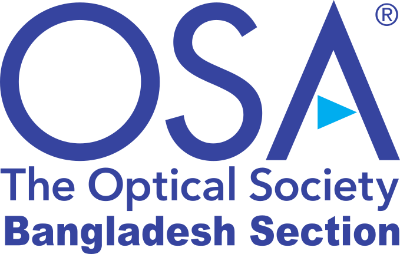
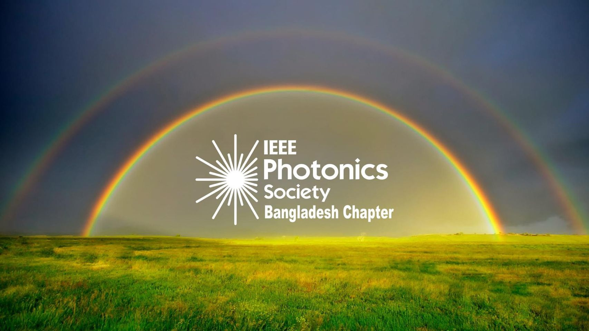
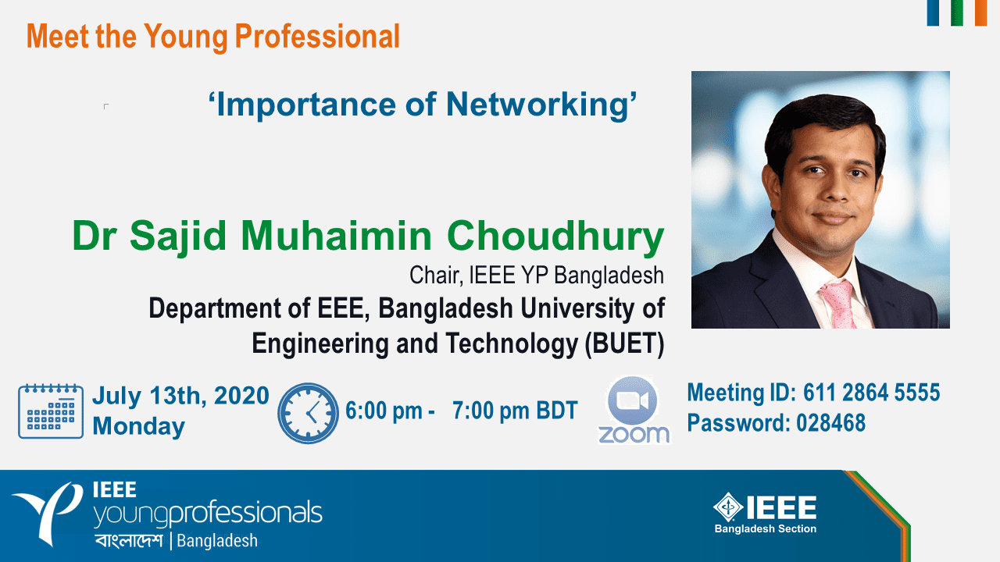
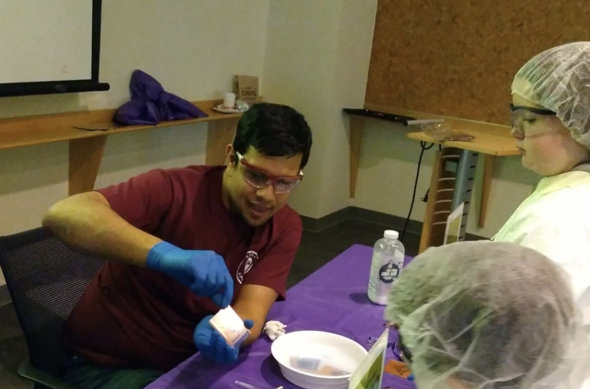
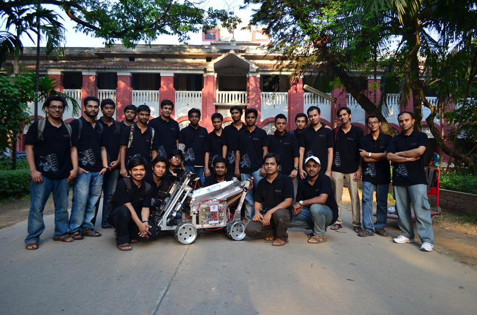

### BUET

#### Secretary, IEEE Bangladesh Section

I won the election of Secretary-Elect of IEEE Bangladesh Section. I secured highest number of votes among all candidates in the 2021 IEEE Bangladesh Section ExCom election. I was reelected secretary in 2023. 

#### Founding President, The Optical Society - OSA Bangladesh Section

I actively ran the membership drive to increase the number of OSA members in Bangladesh. I took initiative to have general meeting of the OSA members of Bangladesh, and the members decided on an election committee. I was elected president of the OSA Bangladesh Section. After submitting the petition document, the Bangladesh Section officially started its journey on May 1, 2021.

#### Founding Chair , IEEE Photonics Society Bangladesh Chapter 2021

I actively ran a membership drive and petitioned for establishing the IEEE Photonics Society Bangladesh Chapter. I became the interim chair of the Photonics Society Bangladesh Chapter. IEEE Photonics Society Bangladesh Chapter started its journey on March 22, 2021. I am currently serving as the vice-chair of the Technical chapter since 2022 January

#### Chair, IEEE YP BDS 2020

IEEE Young Professionals BDS works to help fresh graduates transition to professional career. I became chair of the affinity group in 2020. During my tenure as the YP Chair, I completely redesigned the website of [IEEE YP Bangladesh](https://r10.ieee.org/bd-yp). We had to improvise the changing situation of Covid, oversawing the transition to virtual activities. I organized the first interdisciplinary workshop for the Interface of Electronics and Biology, inviting Dr. Firdausi Qadri and Dr. Muhammad Ashraful Alam in YP. I also introduced weekly "Meet the Young Professional" webinar series, where non-resident Bangladeshi EEE graduates mentors young professional engineers and graduate students, and talks about their own work and research. Webinars included speakers from academia, research scientists from National Laboratories, research scientists and engineers from companies like Intel, Facebook, Qualcomm, Boston Scientific. Under my leadership, YP Bangladesh saw record high number of activities.

### Purdue University
#### OSA Purdue Chapter and SPIE Purdue Chapter
Optical Society America Purdue Chapter and SPIE Purdue Chapter represents the student chapter of OSA and SPIE respectively. I was the founding treasurer of the SPIE Purdue Chapter. I also served as the Treasurer of OSA Purdue Chapter 2016-17. I helped organize the first Micro and Nanotechnology Conference for Addressing Grand Challenges for OSA. I represented Purdue in the OSA:Frontiers in Optics (FiO) meeting 2017.

#### Nanotechnology Student Advisory Council

I served as the President of NSAC 2017-18. During my tenure, I successfully got funding for NSAC to improve participation in research discussions. I also pioneered lithography demonstration in the NanoDays [Video](https://www.youtube.com/watch?v=uALHbuyeFpw&t=1s).

#### Bangladesh Students Association Purdue University
I served as the President of BDSA for 2017-18. During my tenure, BDSA took a number of successful ground-breaking endavors as outlined in the [annual report](http://www.bdsapurdue.org/2018/05/bdsa-annual-general-meeting-dinner.html), including [Fund Raising for Bangladeshi Flood](http://www.bdsapurdue.org/2017/09/bdsa-fundraising-effort-for-flood.html), [Printed Magazine](http://www.bdsapurdue.org/2018/06/bdsa-magazine-2017-18-edition.html), [Own Webdomain](http://www.bdsapurdue.org), [Tshirt](http://www.bdsapurdue.org/2017/11/bdsa-cordially-invites-everyone-to-bdsa.html), [Undergrad Symposium](http://www.bdsapurdue.org/2017/10/bdsa-ug-symposium.html), [Women  Symposium](http://www.bdsapurdue.org/2018/02/bangladesh-students-association-purdue.html), [Academic Trip](http://www.bdsapurdue.org/2018/01/subaru-factory-trip-by-bdsa-members.html), [Movie Screening](http://www.bdsapurdue.org/2018/05/bdsa-special-symposium-sunny-sanwar.html), [Bangladesh Night Celebration](http://www.bdsapurdue.org/2017/10/bangladesh-night-thank-you-note.html).

### BUET (Before 2013)
#### BUET Lunabotics Team 2013

I was extremely lucky to be the faculty advisor for BUET Lunabotics Team 2013, that participated in the NASA Lunabotics Competition. BUET team 
started their design from scratch, and ended up in 15th position in the contest. Due to an unfortunate Wi-Fi module failure, robot stopped working in second round.

#### IEEE GOLD Chair
I served as the chair of the Graduates of Last Decade (GOLD) now renames as IEEE Young Professionals, in 2013. During my tenure, I organized professional development workshop on LaTex and organized trip to the AERE Savar.

#### IEEE BUET Student Branch Chair
I served as IEEE BUET Student Branch chair, and represented BUET at the IEEE R10 Student/GOLD/WIE Congress in Chennai, 2008. 